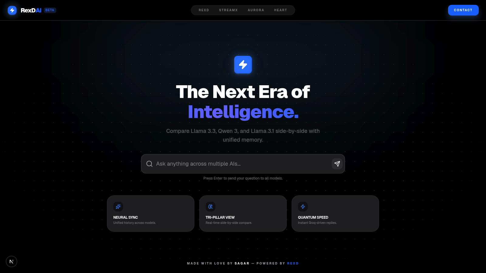

# RexDAi — The Next Era of Intelligence

RexDAi is a cutting-edge, high-performance AI aggregator designed for the modern web. In an era where different AI models excel at different tasks, RexDAi provides a unified interface to query the world's most powerful models—**Llama 3.3 70B**, **Qwen 3 32B**, and **Llama 3.1 8B**—simultaneously.

[Visit RexD.space](https://rexd.space)

## Why RexDAi?
Traditional AI interfaces force you to choose one model at a time. RexDAi breaks that barrier with its **Tri-Pillar View**, allowing you to see how different neural architectures interpret the same prompt in real-time. Whether you're debugging code, writing creative content, or researching complex topics, RexDAi helps you find the most accurate and creative response instantly.

## Key Features
- **Neural Sync & Unified History:** Unlike other aggregators, RexDAi maintains a synchronized conversation history across all models, ensuring that every AI has the full context of your previous interactions.
- **Quantum-Speed Edge Runtime:** Leveraging Next.js 16 Edge Runtime and Groq's LPUs, RexDAi delivers responses with near-zero latency, making it one of the fastest AI comparison tools available.
- **Mobile Card Deck:** A bespoke mobile layout that transforms the desktop grid into a fluid, swipable card deck. Navigate between AI responses with a single tap or swipe.
- **Minimalist Aesthetic:** A distraction-free UI built with Tailwind CSS 4, featuring smooth Framer Motion animations and a deep-black dark mode optimized for OLED displays.

## Part of the RexD Ecosystem
RexDAi is a flagship product of the **RexD** ecosystem—a curated suite of high-performance web applications designed to simplify and enhance the digital experience.

- **[StreamX](https://dub.sh/StreamXOne):** An open source aggregator which curates movies and TV shows online for everyone to enjoy freely.
- **[Aurora](https://dub.sh/AuroraWeb/):** 🎧 Soothing sounds for focus and relaxation.
- **[Heart](https://dub.sh/HeartWeb/):** This site is a place for everything I’m exploring.
- **[RexD.space](https://rexd.space):** The central hub for all our experiments in speed, design, and intelligence.
- **& Many More:** Our laboratory is constantly running. From developer utilities to creative experiments, RexD is a commitment to building a faster, more beautiful web.

## Technical Architecture
- **Framework:** Next.js 16 (Edge Runtime)
- **Library:** React 19 (Server Components & Actions)
- **Styling:** Tailwind CSS 4
- **Animations:** Framer Motion 12
- **Infrastructure:** Vercel / Cloudflare Edge
- **API Provider:** Groq SDK (Llama & Qwen)

---

**Made with love by [Sagar](https://dub.sh/moment).**
*Powered by [RexD](https://dub.sh/rexd.space)*
